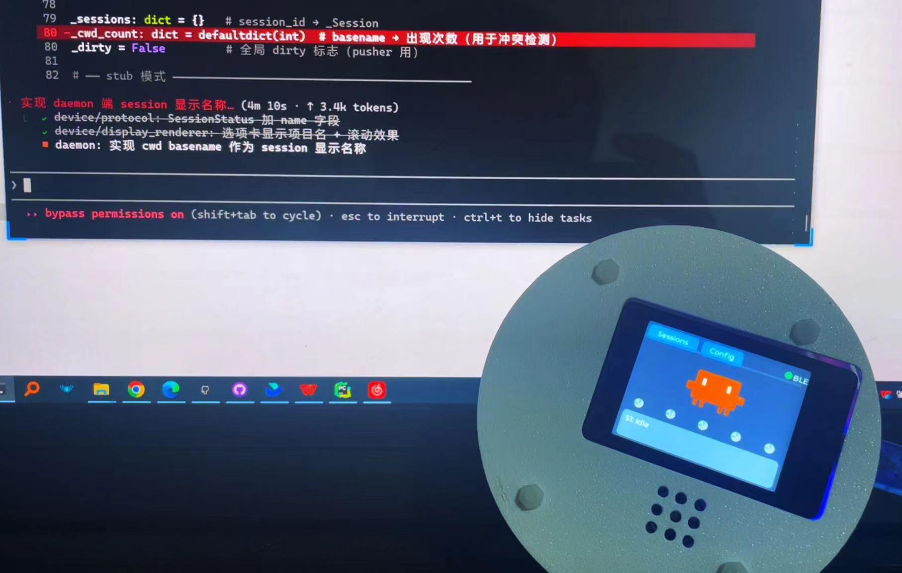
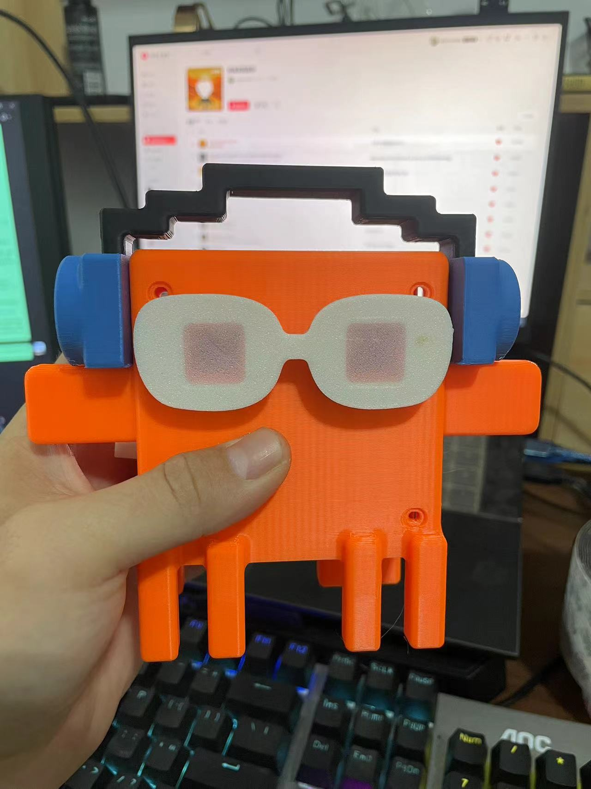

# MicroPython Claude Assistant（码克助手）

将 Claude Code 的工具执行状态实时可视化为 ESP32 桌宠设备——灯光闪烁 + 语音播报提醒用户查看终端。

| clock 闹钟版 | panel 面板版 |
|:---:|:---:|
|  |  |
|  |  |
|  |  |

---

## 硬件形态

| 形态 | 主控 | 输出 | 特性 |
|------|------|------|------|
| **panel**（状态面板） | ESP32-S3 | ST7789 2.4寸屏 + LVGL | 小人动画 + 多session历史记录 |
| **clock**（闹钟灯） | ESP32-C3 | WS2812×2 + MAX98357A扬声器 | 灯光状态 + 豆包TTS语音播报 |

两种形态共用同一份固件代码，`config.py` 中 `VARIANT` 字段区分。

---

## 项目结构

```
MicroPython_Claude_Assistant/
├── daemon/              # PC 守护进程层
│   ├── ble_daemon.py    # 核心：TCP↔BLE桥接，状态机，5Hz推送
│   ├── hook_bridge.py   # Claude Code Hook接收，规范化为v2 envelope
│   ├── transport.py     # BLE连接管理（bleak），自动重连
│   ├── pair_device.py   # 扫描配对Claude-Buddy设备，保存MAC配置
│   ├── smoke.py         # 装机后烟测：验证daemon TCP可达
│   └── risk_config.py   # 风险分级配置（v5已废弃，保留供参考）
│
├── device/              # ESP32 固件层（MicroPython）
│   ├── main.py              # 主程序入口：BLE接收 + 渲染调度
│   ├── config.py            # 硬件引脚与全局常量（可自定义）
│   ├── protocol.py          # wire协议解析：{"ss":[...]} → SessionStatus对象
│   ├── transport.py         # BLE NUS驱动，20B MTU分包/重组
│   ├── state.py             # 状态枚举与转换逻辑
│   ├── renderer.py          # 渲染器抽象基类
│   ├── display_renderer.py  # panel形态：LVGL屏幕渲染器
│   ├── light_renderer.py    # clock形态：WS2812灯光 + 语音渲染器
│   ├── voice_task.py        # clock形态：I2S语音播放，队列不打断
│   ├── display.py           # LVGL组件封装（panel专用）
│   ├── buddy.py             # ASCII角色动画控制器（panel专用）
│   ├── buddies.py           # 角色帧数据：CAT/ROBOT/DUCK（panel专用）
│   ├── character.py         # 角色形象接口，换形象只改一行import
│   ├── logo_data.py         # 像素风Claude Logo数据
│   ├── play_pcm_loop.py     # 调试用：独立PCM循环播放测试
│   ├── queue.py             # asyncio Queue兼容层（MicroPython）
│   └── assets/              # TTS语音PCM文件（8kHz单声道16bit）
│       ├── bv701-...-startup-01.pcm
│       ├── bv701-...-connect-01.pcm
│       ├── bv701-...-disconnect-01.pcm
│       ├── bv701-...-done-0[1-4].pcm
│       ├── bv701-...-error-0[1-4].pcm
│       ├── bv701-...-pending-0[1-4].pcm
│       └── bv701-...-working-0[1-4].pcm
│
├── scripts/             # 工具脚本
│   ├── sim_hooks_v5.py      # 集成测试：模拟Hook事件序列
│   ├── flash_device.py      # ESP32固件烧录脚本
│   ├── gen_voice_assets.py  # TTS语音生成工具（GUI + 命令行）
│   ├── ble_test_send.py     # BLE原始连接测试，发一条消息看回应
│   ├── demo_v5.py           # v5架构演示脚本（mock transport）
│   ├── hook_probe.py        # Hook探活：记录所有真实Hook payload到jsonl
│   ├── logo_converter.py    # 图片转像素风logo数据
│   ├── test_recv.py         # 设备端BLE接收测试（需烧录到ESP32）
│   ├── test_tts_voices.py   # 在ESP32上测试TTS语音（需WiFi）
│   └── requirements.txt     # PC端Python依赖
│
├── tests/               # 自动化测试
│   ├── test_protocol.py           # protocol单元测试（21用例）
│   ├── test_hook_normalize.py     # hook_bridge规范化测试（7组）
│   ├── test_daemon_state.py       # daemon状态机时序测试（18组）
│   ├── test_v5_basic.py           # v5基本功能验证（5组）
│   ├── test_e2e_stub.py           # E2E联动测试（无需设备）
│   ├── test_daemon_concurrency.py # daemon并发压测（3组）
│   ├── test_hook_simple.py        # Hook超时行为简单测试
│   ├── test_hook_timeout.py       # Hook超时行为详细测试
│   └── fixtures/probe_samples/    # 8类真实Hook payload样本
│
├── hooks/               # Claude Code Plugin Hook 配置
│   └── hooks.json           # plugin 的 hook 注册声明（${CLAUDE_PLUGIN_ROOT} 变量由 Claude Code 展开）
│
├── research/            # 设计文档
│   ├── hook_to_device_mapping_v1.md    # 协议演进完整记录（v1→v5）
│   ├── v5_implementation_summary.md   # v0.9.0 MVP实施总结
│   ├── install_mechanism_v1.md        # 量产装机机制调研
│   └── hook_probe_settings_template.json # 探活用全Hook配置模板
│
├── docs/                # 效果图
├── pyproject.toml       # Python包配置（uv/pip安装用；定义 claude-buddy-* 入口点）
└── skill.md             # Claude Code skill 描述（对话触发装机向导）
```

---

## 安装部署

> **推荐：以 Claude Code Plugin 方式安装**（自动注册 hook，无需手动改配置）
>
> ```bash
> claude plugin install claude-buddy
> ```
>
> Plugin 安装后 hook 自动生效，**跳过下方第一步和第六步**，从第二步（生成语音）开始。
>
> 以下步骤适用于**手动安装**（无 plugin 分发、本地开发调试）。

### 前置要求

**PC端**：
- Python 3.11+
- Windows 10/11（BLE 支持）

**ESP32端**：
- ESP32 已刷入 MicroPython 固件（[官方下载](https://micropython.org/download/)）
- USB 数据线连接 PC

---

### 第一步：安装 PC 端依赖

```bash
cd G:/MicroPython_Claude_Assistant
pip install -r scripts/requirements.txt
```

依赖清单：`bleak`（BLE）、`websockets`（TTS API）、`pyserial`（串口烧录）、`Pillow`（图片处理）

还需要安装烧录工具：
```bash
pip install mpremote          # ESP32文件传输工具（必须）
pip install mpy-cross         # 字节码编译器（可选，安装后固件更小）
```

---

### 第二步：生成语音文件（clock形态专属）

> panel 形态跳过此步骤

clock 形态需要 TTS 语音 PCM 文件，烧录前先生成：

```bash
python scripts/gen_voice_assets.py   # 打开GUI
```

1. 在豆包[语音控制台](https://console.volcengine.com/speech/service/10007)获取 App ID 和 Access Token
2. GUI中选择音色、调节参数，逐状态生成并保存
3. 文件自动保存到 `device/assets/`，烧录时一并上传

> 已有默认语音文件（bv701音色），可直接跳到第三步使用默认语音。

---

### 第三步：烧录 ESP32 固件

**确保 ESP32 通过 USB 连接 PC，MicroPython 已刷入。**

```bash
# 闹钟版（ESP32-C3 + WS2812 + 扬声器）
python scripts/flash_device.py --variant clock

# 面板版（ESP32-S3 + ST7789屏幕）
python scripts/flash_device.py --variant panel
```

烧录脚本自动完成以下步骤：
1. 扫描可用串口，多口时手动选择
2. 读取设备 MAC 后4位，生成唯一 BLE 名称 `Claude-Buddy-XXXX`
3. 生成注入了 BLE_NAME 和 VARIANT 的 `config.py`
4. 安装 `aioble` 依赖库到设备
5. 编译并上传所有 `device/*.py` 文件（有 mpy-cross 则编译为字节码）
6. 上传 `device/assets/` 语音文件
7. 重启设备

烧录完成后设备自动开机，clock 版会播放开机语音并显示等待连接灯光。

---

### 第四步：配对设备

**确保设备已开机并通过BLE广播。**

```bash
python daemon/pair_device.py
```

脚本扫描周围 BLE 设备，找到 `Claude-Buddy-XXXX` 后选择确认，MAC 地址保存到：
- Windows：`%APPDATA%\claude-buddy\device.json`

> 同一台 PC 只需配对一次，后续 daemon 自动连接。

---

### 第五步：启动守护进程

**每次使用前需要启动，保持终端窗口运行。**

```bash
python daemon/ble_daemon.py          # 正常模式（自动连接已配对设备）
python daemon/ble_daemon.py --stub   # stub模式（无设备，用于调试）
```

daemon 启动后自动搜索并连接 ESP32，连接成功后设备播放连接语音/动画。

---

### 第六步：注册 Claude Code Hook

> **Plugin 安装用户跳过此步**，hook 已由 `hooks/hooks.json` 自动注册。

手动安装时，在 `C:\Users\<用户>\.claude\settings.json` 中添加（**替换路径为实际路径**）：

```json
{
  "hooks": {
    "PreToolUse":       [{"hooks": [{"type": "command", "command": "python G:/MicroPython_Claude_Assistant/daemon/hook_bridge.py"}]}],
    "PostToolUse":      [{"hooks": [{"type": "command", "command": "python G:/MicroPython_Claude_Assistant/daemon/hook_bridge.py"}]}],
    "PostToolBatch":    [{"hooks": [{"type": "command", "command": "python G:/MicroPython_Claude_Assistant/daemon/hook_bridge.py"}]}],
    "Stop":             [{"hooks": [{"type": "command", "command": "python G:/MicroPython_Claude_Assistant/daemon/hook_bridge.py"}]}],
    "UserPromptSubmit": [{"hooks": [{"type": "command", "command": "python G:/MicroPython_Claude_Assistant/daemon/hook_bridge.py"}]}]
  }
}
```

配置后重启 Claude Code 生效。

---

### 第七步：验证

```bash
python daemon/smoke.py               # 验证daemon TCP可达（退出码0=正常）
python scripts/sim_hooks_v5.py --stub  # 模拟一次完整任务流转
```

smoke 通过后，在 Claude Code 中执行任意工具（如 Read 文件），设备应出现对应灯光/动画。

---

### 日常使用流程

```
每次使用：
  1. 开机 ESP32 设备（USB供电或电池）
  2. PC 启动 daemon：python daemon/ble_daemon.py
  3. 打开 Claude Code，正常使用即可
  4. 设备自动反映 Claude 工作状态
```

---

## scripts/ 工具说明

### `scripts/flash_device.py` — 固件烧录

自动完成：扫描COM口 → 读取MAC → 生成config → 安装aioble → 编译上传 → 重启。

```bash
python scripts/flash_device.py                   # 默认panel形态
python scripts/flash_device.py --variant clock   # 闹钟形态
python scripts/flash_device.py --variant panel   # 面板形态
```

| 参数 | 说明 |
|------|------|
| `--variant clock` | 烧录闹钟版（WS2812 + 扬声器） |
| `--variant panel` | 烧录面板版（ST7789屏幕），默认值 |

流程步骤：
1. 扫描串口，多口时手动选择
2. 读取设备MAC后4位，生成唯一BLE名称 `Claude-Buddy-XXXX`
3. 生成 `config.py`（注入BLE_NAME和VARIANT）
4. 安装 `aioble` 依赖库
5. 用 `mpy-cross` 编译为 `.mpy`（若未安装则上传源码）
6. 上传所有 `device/*.py` 文件和 `assets/` 语音文件
7. 重启设备

---

### `scripts/sim_hooks_v5.py` — 集成测试

模拟 Claude Code 触发 Hook 事件，完整测试 hook_bridge → daemon → BLE → 设备 全链路。

```bash
# 基本用法
python scripts/sim_hooks_v5.py --stub          # 无设备（daemon自动以stub模式启动）
python scripts/sim_hooks_v5.py                 # 真设备（需ESP32已开机）
python scripts/sim_hooks_v5.py --no-daemon     # daemon已手动启动时跳过自动启动

# 单个测试序列
python scripts/sim_hooks_v5.py --stub --multi-session    # 基本功能：I→W→C流转
python scripts/sim_hooks_v5.py --stub --multi-session    # 多session并发
python scripts/sim_hooks_v5.py --stub --parallel-tools   # 并行工具批次
python scripts/sim_hooks_v5.py --stub --error-handling   # 错误处理
python scripts/sim_hooks_v5.py --stub --interrupted      # 工具中断
python scripts/sim_hooks_v5.py --stub --web-tools        # WebFetch/WebSearch
python scripts/sim_hooks_v5.py --stub --long-task        # 长任务（多轮工具）
python scripts/sim_hooks_v5.py --stub --session-restart  # 多轮对话
python scripts/sim_hooks_v5.py --stub --mixed-tools      # 混合工具类型
python scripts/sim_hooks_v5.py --stub --multi-session-error # 多session含错误
python scripts/sim_hooks_v5.py --stub --rapid-fire       # 快速连续工具
python scripts/sim_hooks_v5.py --stub --subagent         # Subagent嵌套
python scripts/sim_hooks_v5.py --stub --long-message     # 60字符长消息跑马灯
python scripts/sim_hooks_v5.py --stub --approval         # PENDING状态提醒
python scripts/sim_hooks_v5.py --stub --gui-face         # panel：脸部状态切换
python scripts/sim_hooks_v5.py --stub --gui-5sessions    # panel：5个session并发
python scripts/sim_hooks_v5.py --stub --gui-priority     # panel：消息块优先级
python scripts/sim_hooks_v5.py --clock                   # clock：灯光+语音完整测试
python scripts/sim_hooks_v5.py --stub --all              # 运行全部序列（约6分钟）

# 其他选项
python scripts/sim_hooks_v5.py --stub --no-cooldown      # 去掉序列间冷却等待
python scripts/sim_hooks_v5.py --stub --skip-ble-check   # 跳过BLE连接检查
```

---

### `scripts/gen_voice_assets.py` — TTS语音生成

使用字节跳动豆包TTS API生成语音PCM文件，供clock形态使用。

```bash
python scripts/gen_voice_assets.py           # 启动GUI
python scripts/gen_voice_assets.py --auto    # 命令行批量生成（跳过人工确认）
```

**GUI操作流程**：
1. 填入豆包 App ID 和 Access Token（[控制台](https://console.volcengine.com/speech/service/10007)）
2. 选择音色（支持200+种：BV701通用女声、各类情感音色、方言等）
3. 调节语速（建议1.3-1.6）、语调（建议1.0-1.2）、音量
4. 选择状态类型（startup/connect/disconnect/done/error/pending/working）
5. 选择或编辑文本，点击"生成"
6. 试听满意后点"保存"，文件自动命名并保存到 `device/assets/`

**PCM文件命名规范**：
```
{音色}-{语调}-{语速}-{音量}-{采样率}-{状态}-{序号}.pcm
示例：bv701-1.2-1.6-1.5-8000-done-01.pcm
```

**语音状态说明**：

| 状态 | 触发时机 | 说明 |
|------|---------|------|
| `startup` | 设备开机 | 开机自报，固定播1次 |
| `connect` | BLE连接成功 | 每次连接播1次 |
| `disconnect` | BLE断线 | 断线后循环播，直到重连 |
| `done` | 任务完成（C状态） | 随机从多个变体选 |
| `error` | 任务出错（E状态） | 随机从多个变体选 |
| `pending` | 等待审批（P状态） | 随机从多个变体选 |
| `working` | 偶发工作中播报 | 空闲90-180秒后随机播 |

**空间限制**：ESP32C3 Flash有限，每个状态建议保留1-4个变体，总PCM不超过2MB。

**自定义音色**：在 `JOBS` 列表中修改音色、参数，重新运行即可批量替换：

```python
JOBS = [
    ("bv701", 1.2, 1.6, 1.5, None, 8000),  # (音色, 语调, 语速, 音量, 情感, 采样率)
]
```

---

## device/ 配置说明

### `device/config.py` — 可自定义项

**BLE配置**：
```python
BLE_NAME = "Claude-Buddy-XXXX"   # 烧录时自动注入MAC后4位
```

**闹钟版引脚**（按实际硬件修改）：
```python
CLOCK_LED_PIN    = 21   # WS2812数据引脚
CLOCK_LED_COUNT  = 2    # 灯珠数量
CLOCK_SPK_LRC    = 9    # I2S LRC
CLOCK_SPK_BCLK   = 8    # I2S BCLK
CLOCK_SPK_DIN    = 7    # I2S DIN
CLOCK_AMP_SD_PIN = 5    # 功放使能
```

**语音行为**：
```python
VOICE_HISTORY_DEPTH = 10    # 语音上下文历史深度
VOICE_IDLE_MIN_S    = 90    # 偶发工作播报最短间隔（秒）
VOICE_IDLE_MAX_S    = 180   # 偶发工作播报最长间隔（秒）
```

### `device/character.py` — 换形象

panel形态切换角色只需改一行：
```python
from buddies import CAT as SPECIES    # 猫
from buddies import ROBOT as SPECIES  # 机器人
from buddies import DUCK as SPECIES   # 鸭子
```

---

## 自定义

### 换语音音色（clock 形态）

使用 `scripts/gen_voice_assets.py` 重新生成 PCM 文件，再烧录到设备：

```bash
python scripts/gen_voice_assets.py    # 打开 GUI，选音色/调参数/逐状态生成
```

1. 在 `JOBS` 列表中改音色和参数（支持200+种豆包音色）：
   ```python
   JOBS = [
       ("BV701", 1.2, 1.6, 1.5, None, 8000),  # (音色, 语调, 语速, 音量, 情感, 采样率)
   ]
   ```
2. 生成的 PCM 自动保存到 `device/assets/`
3. 重新烧录上传：`python scripts/flash_device.py --variant clock`

**空间限制**：ESP32-C3 Flash 有限，每状态建议保留 1-4 个变体，总 PCM ≤ 2MB。

> 详细参数说明见 [scripts/gen_voice_assets.py 节](#scriptsgen_voice_assetspy--tts语音生成)

---

### 换面板角色形象（panel 形态）

编辑 `device/character.py`，改一行 import：

```python
from buddies import CAT as SPECIES    # 猫（默认）
from buddies import ROBOT as SPECIES  # 机器人
from buddies import DUCK as SPECIES   # 鸭子
```

修改后重新烧录：`python scripts/flash_device.py --variant panel`

---

### 换面板 Logo（panel 形态）

替换 `scripts/assets/claude-code-logo.png`（橙色像素图，建议 110×110），然后运行转换脚本：

```bash
python scripts/logo_converter.py    # 提取橙色像素 → 生成 device/logo_data.py
```

再烧录：`python scripts/flash_device.py --variant panel`

---

### 调整语音行为参数（clock 形态）

编辑 `device/config.py`（烧录时自动生成，修改后需重新烧录）：

```python
VOICE_HISTORY_DEPTH = 10    # 语音上下文历史深度
VOICE_IDLE_MIN_S    = 90    # 偶发工作播报最短间隔（秒）
VOICE_IDLE_MAX_S    = 180   # 偶发工作播报最长间隔（秒）
```

修改后重新烧录：`python scripts/flash_device.py --variant clock`

---

## tests/ 测试说明

所有测试无需 pytest，直接运行，退出码0为通过。

```bash
# 推荐顺序：从底层到高层
python tests/test_protocol.py           # protocol解析单元测试（21用例）
python tests/test_hook_normalize.py     # hook_bridge规范化测试（7组）
python tests/test_v5_basic.py           # v5架构基本验证（5组）
python tests/test_daemon_state.py       # daemon状态机时序测试（18组）
python tests/test_e2e_stub.py           # E2E联动测试，无需设备（stub）
python tests/test_daemon_concurrency.py # daemon并发压测，会启动真实stub daemon
```

| 测试文件 | 用例数 | 需要设备 | 说明 |
|---------|--------|---------|------|
| `test_protocol.py` | 21 | 否 | parse()、SessionStatus、build_*函数 |
| `test_hook_normalize.py` | 7 | 否 | 8类hook→v2 envelope规范化 |
| `test_v5_basic.py` | 5 | 否 | 验证审批相关代码已删除 |
| `test_daemon_state.py` | 18 | 否 | mock time驱动状态机，捕获wire输出 |
| `test_e2e_stub.py` | - | 否 | 真实进程通信，--stub模式 |
| `test_daemon_concurrency.py` | 3 | 否 | 多socket并发，守恒性验证 |
| `test_hook_simple.py` | - | 否 | Hook超时行为快速验证 |
| `test_hook_timeout.py` | - | 否 | Hook超时行为详细测试 |

---

## daemon/ 说明

### `daemon/ble_daemon.py`

长驻守护进程，核心状态机。

```bash
python daemon/ble_daemon.py            # 正常模式
python daemon/ble_daemon.py --stub     # stub模式：BLE改为stdout打印
python daemon/ble_daemon.py --offline  # 离线模式：不尝试BLE连接
```

**关键行为**：
- 监听 TCP `127.0.0.1:57320`，接收 hook_bridge 推来的 v2 envelope
- 每个 `session_id` 独立 `_Session` 对象，支持多 Claude Code 实例并发
- 5Hz 节流推送（状态变化标 dirty，200ms 一次推送）
- Stop hook 不稳定：用"4秒无新PreTool"推断任务完成（有subagent时8秒）
- 单向推送，无心跳，无审批等待

### `daemon/hook_bridge.py`

被 Claude Code Hook 调用（stdin 接收 payload，stdout 返回决策）。

每次调用耗时 < 5ms，不阻塞 Claude Code 工具执行。

### `daemon/pair_device.py`

```bash
python daemon/pair_device.py      # 扫描5秒，选择设备，保存配置
```

### `daemon/smoke.py`

```bash
python daemon/smoke.py    # 退出码0=daemon正常，1=不可达
```

---

## 架构与数据流

```
Claude Code（终端）
  │ Hook事件（PreToolUse / PostToolUse / Stop 等）
  ▼
hook_bridge.py（stdin/stdout，< 5ms）
  │ v2 envelope（JSON）via TCP 57320
  ▼
ble_daemon.py（长驻进程，状态机）
  │ v5 wire {"ss":[{"n":"proj","s":"W","m":"Read: main.py"}]}
  │ BLE NUS，20B/chunk，1-5 chunks
  ▼
ESP32 设备
  ├── panel形态 → LVGL屏幕动画 + session历史
  └── clock形态 → WS2812灯光 + TTS语音播报
```

**v5 特性**：
- 单向推送，无心跳，无审批等待
- 5Hz节流，多session并发
- 消息长度60字符（panel跑马灯，clock灯光+语音）

---

## PC → ESP32 消息协议（wire 格式）

### 状态推送

```json
{"ss": [
  {"n": "my_project", "s": "W", "m": "Bash: pytest tests/ -v"},
  {"n": "another",    "s": "C"}
]}
```

### 字段说明

| 字段 | 类型 | 含义 | 长度限制 |
|------|------|------|---------|
| `ss` | array | 所有活跃session数组 | - |
| `n`  | str  | session显示名称（项目目录名） | ≤12字符 |
| `s`  | str  | 状态枚举 | 1字符 |
| `m`  | str  | 工具描述（仅W状态） | ≤60字符 |

### 状态枚举

| 值 | 含义 | clock灯光 | panel动画 |
|----|------|---------|---------|
| `I` | Idle — 空闲 | 蓝色呼吸 | 呼吸动画 |
| `W` | Working — 执行中 | 青色流水 | 忙碌动画 |
| `P` | Pending — 等待审批 | 黄色慢闪 | 闪烁提示 |
| `C` | Completed — 完成 | 绿色快闪3次 | 庆祝动画 |
| `E` | Error — 出错 | 红色交替闪 | 错误动画 |

### BLE 传输

- MTU：20字节/chunk（BLE NUS标准）
- 推送频率：5Hz（200ms间隔）
- 典型大小：21-95B，1-5 chunks

---

## hook_bridge 发出的 8 类事件

### 1. tool_start（PreToolUse）
```json
{
  "kind": "tool_start",
  "tool": "Bash",
  "tool_category": "exec",
  "summary": "ls -la /src",
  "needs_approval": true,
  "tool_use_id": "toolu_xxx"
}
```
- `needs_approval`：Bash/Write/Edit 为 true，但 v5 不阻塞，始终立即返回 `{}`
- 审批由 Claude Code 在终端完成，设备显示 PENDING 状态提醒

### 2. tool_done（PostToolUse）
```json
{
  "kind": "tool_done",
  "tool": "Bash",
  "tool_category": "exec",
  "duration_ms": 1234,
  "tool_use_id": "toolu_xxx"
}
```

### 3. tool_error（PostToolUseFailure）
```json
{
  "kind": "tool_error",
  "tool": "Bash",
  "tool_category": "exec",
  "error_msg": "command not found...",
  "is_interrupt": false,
  "duration_ms": 500,
  "tool_use_id": "toolu_xxx"
}
```

### 4. tool_batch_done（PostToolBatch）
```json
{
  "kind": "tool_batch_done",
  "batch_size": 3,
  "tools": ["Read", "Glob", "Grep"]
}
```
- 并行工具整批完成信号，daemon 用作 task_complete 强信号

### 5. subagent_start（SubagentStart）
```json
{
  "kind": "subagent_start",
  "agent_id": "agent_xxx",
  "agent_type": "Explore"
}
```
- 只有 Start，无 Stop（SubagentStop 未被观测到触发）

### 6. notification（Notification）
```json
{
  "kind": "notification",
  "notification_type": "permission_prompt",
  "message": "Claude Code needs your attention"
}
```
- 实测只见过 `permission_prompt` 类型

### 7. user_prompt（UserPromptSubmit）
```json
{
  "kind": "user_prompt",
  "prompt": "继续"
}
```
- turn 开始的强信号，prompt 截断 80 字

### 8. task_error（StopFailure）
```json
{
  "kind": "task_error",
  "error": "unknown",
  "last_assistant_message": "API Error: Stream idle timeout..."
}
```
- 整个 assistant turn 崩溃（API超时 / stream中断等）

---

## 变更记录

| 版本 | 日期 | 内容 |
|------|------|------|
| v1.0 | 2026-04-27 | 初始版本：v1 wire（6字段），hook_bridge，daemon状态机，基础测试 |
| v2.0 | 2026-05-03 | wire升级v2（9字段，+category/error/interrupted）；状态机重构为_tools字典；修复4个hook_bridge问题；新增test_protocol（17用例）、test_e2e_stub |
| v3.0 | 2026-05-04 | wire升级v3（sessions数组）；per-session _Session对象，修复多实例并发竞争；新增sim_hooks.py集成测试 |
| v4.0 | 2026-05-04 | 心跳机制（ping/pong）+ 分层fail-open审批策略；新增risk_config.py；全部测试49用例通过 |
| v5.0 | 2026-05-06 | 删除设备审批，改为纯展示模式；删除心跳；wire简化为ss数组（n/s/m）；daemon代码减少32%；新增sim_hooks_v5.py |
| v5.1 | 2026-05-12 | 消息长度15→60字符；panel主界面跑马灯滚动；Sessions历史自动换行；新增长消息测试序列 |
| v0.9.0 | 2026-05-18 | **MVP可用**：clock形态完成（WS2812硬件定时器+语音队列）；灯光/语音FIFO队列+去重不打断；开机自报"码克助手"；连接/断线灯光语音；flash_device.py烧录脚本；gen_voice_assets.py TTS生成GUI；双形态完整验证 |
